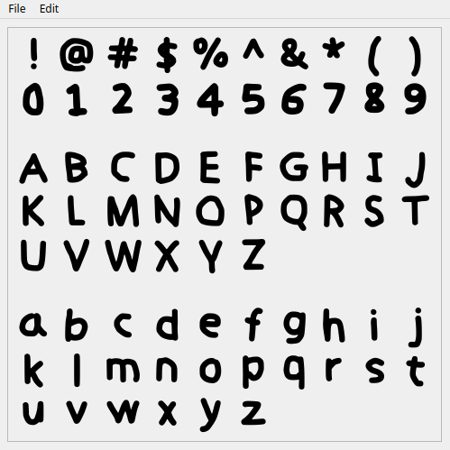

<p align="center">
  
</p>

This is a Python program I made for the purpose of opening a TTF file and allowing you to display / save images of the characters within the file.

## Requirements

-    Python 3.x
-    PyQt5
-    Pillow

All modules can be installed by running

```python
pip install -r requirements.txt
```

([requirements.txt](/src/requirements.txt) is located in the [src](/src) folder)

## How to Use

1.    Run the script using the command `python FontExtract-GUI.py` (or CLI if you prefer).
2.    Press `File` -> `Open Font` to select your TTF file.
3.    Right click an image to `Save As` that specifc character as a PNG (Alternatively: use the `Batch Export` option to save every visible character).
4.    In addition, you can use the `Edit` -> `Preferences` menu to change a host of options such as: `Character List`, `Font Size`, `Background Color`, and `Font Color`.

## GUI Preview



## Credits

Created by: [pupper <3](https://github.com/Cadehlinha)

> Licensed under the [MIT License](/LICENSE)